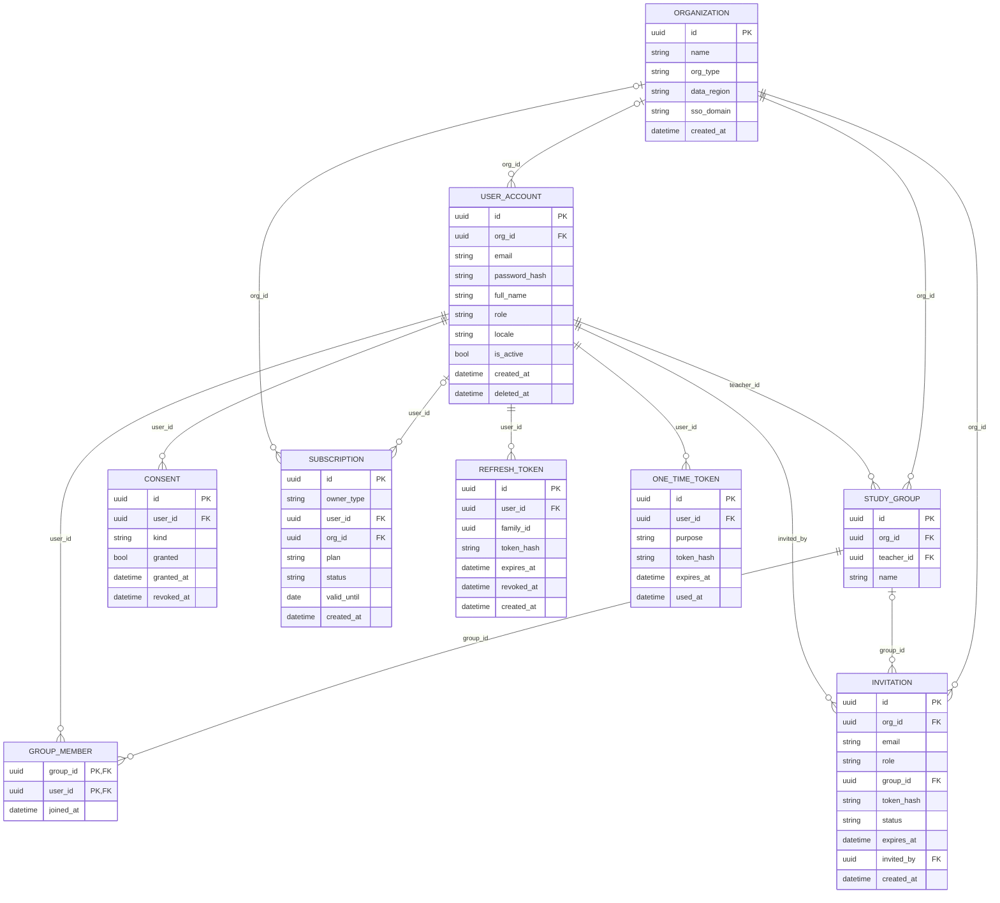
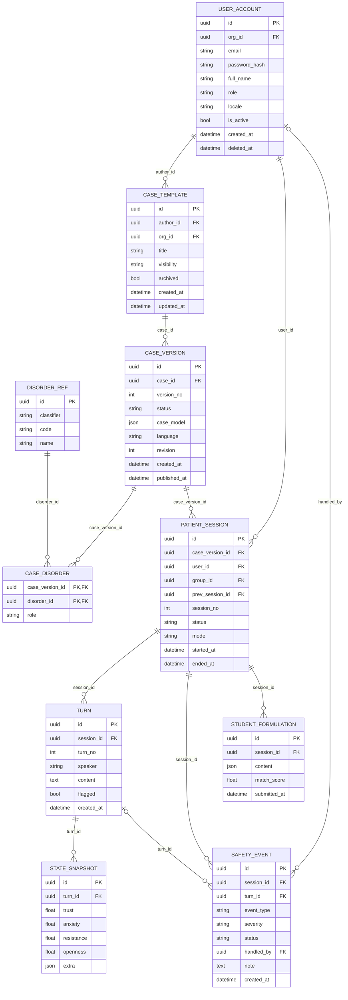
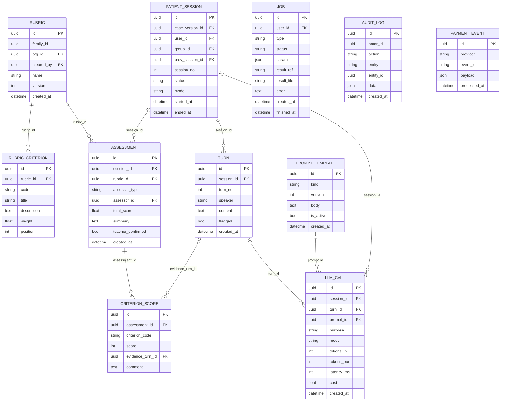

# ER-диаграммы

Генерируются из `backend/app/models.py` командой `make erd`. Не правьте вручную.

## Организации и доступ

```mermaid
erDiagram
  ORGANIZATION {
    uuid id PK
    string name
    string org_type
    string data_region
    string sso_domain
    datetime created_at
  }
  USER_ACCOUNT {
    uuid id PK
    uuid org_id FK
    string email
    string password_hash
    string full_name
    string role
    string locale
    bool is_active
    datetime created_at
    datetime deleted_at
  }
  STUDY_GROUP {
    uuid id PK
    uuid org_id FK
    uuid teacher_id FK
    string name
  }
  GROUP_MEMBER {
    uuid group_id PK, FK
    uuid user_id PK, FK
    datetime joined_at
  }
  CONSENT {
    uuid id PK
    uuid user_id FK
    string kind
    bool granted
    datetime granted_at
    datetime revoked_at
  }
  SUBSCRIPTION {
    uuid id PK
    string owner_type
    uuid user_id FK
    uuid org_id FK
    string plan
    string status
    date valid_until
    datetime created_at
  }
  INVITATION {
    uuid id PK
    uuid org_id FK
    string email
    string role
    uuid group_id FK
    string token_hash
    string status
    datetime expires_at
    uuid invited_by FK
    datetime created_at
  }
  REFRESH_TOKEN {
    uuid id PK
    uuid user_id FK
    uuid family_id
    string token_hash
    datetime expires_at
    datetime revoked_at
    datetime created_at
  }
  ONE_TIME_TOKEN {
    uuid id PK
    uuid user_id FK
    string purpose
    string token_hash
    datetime expires_at
    datetime used_at
  }
  ORGANIZATION |o--o{ USER_ACCOUNT : "org_id"
  ORGANIZATION ||--o{ STUDY_GROUP : "org_id"
  USER_ACCOUNT ||--o{ STUDY_GROUP : "teacher_id"
  STUDY_GROUP ||--o{ GROUP_MEMBER : "group_id"
  USER_ACCOUNT ||--o{ GROUP_MEMBER : "user_id"
  USER_ACCOUNT ||--o{ CONSENT : "user_id"
  USER_ACCOUNT |o--o{ SUBSCRIPTION : "user_id"
  ORGANIZATION |o--o{ SUBSCRIPTION : "org_id"
  ORGANIZATION ||--o{ INVITATION : "org_id"
  STUDY_GROUP |o--o{ INVITATION : "group_id"
  USER_ACCOUNT ||--o{ INVITATION : "invited_by"
  USER_ACCOUNT ||--o{ REFRESH_TOKEN : "user_id"
  USER_ACCOUNT ||--o{ ONE_TIME_TOKEN : "user_id"
```

## Кейсы и сессии

```mermaid
erDiagram
  DISORDER_REF {
    uuid id PK
    string classifier
    string code
    string name
  }
  CASE_TEMPLATE {
    uuid id PK
    uuid author_id FK
    uuid org_id FK
    string title
    string visibility
    bool archived
    datetime created_at
    datetime updated_at
  }
  CASE_VERSION {
    uuid id PK
    uuid case_id FK
    int version_no
    string status
    json case_model
    string language
    int revision
    datetime created_at
    datetime published_at
  }
  CASE_DISORDER {
    uuid case_version_id PK, FK
    uuid disorder_id PK, FK
    string role
  }
  PATIENT_SESSION {
    uuid id PK
    uuid case_version_id FK
    uuid user_id FK
    uuid group_id FK
    uuid prev_session_id FK
    int session_no
    string status
    string mode
    datetime started_at
    datetime ended_at
  }
  TURN {
    uuid id PK
    uuid session_id FK
    int turn_no
    string speaker
    text content
    bool flagged
    datetime created_at
  }
  STATE_SNAPSHOT {
    uuid id PK
    uuid turn_id FK
    float trust
    float anxiety
    float resistance
    float openness
    json extra
  }
  SAFETY_EVENT {
    uuid id PK
    uuid session_id FK
    uuid turn_id FK
    string event_type
    string severity
    string status
    uuid handled_by FK
    text note
    datetime created_at
  }
  STUDENT_FORMULATION {
    uuid id PK
    uuid session_id FK
    json content
    float match_score
    datetime submitted_at
  }
  USER_ACCOUNT {
    uuid id PK
    uuid org_id FK
    string email
    string password_hash
    string full_name
    string role
    string locale
    bool is_active
    datetime created_at
    datetime deleted_at
  }
  USER_ACCOUNT ||--o{ CASE_TEMPLATE : "author_id"
  CASE_TEMPLATE ||--o{ CASE_VERSION : "case_id"
  CASE_VERSION ||--o{ CASE_DISORDER : "case_version_id"
  DISORDER_REF ||--o{ CASE_DISORDER : "disorder_id"
  CASE_VERSION ||--o{ PATIENT_SESSION : "case_version_id"
  USER_ACCOUNT ||--o{ PATIENT_SESSION : "user_id"
  PATIENT_SESSION ||--o{ TURN : "session_id"
  TURN ||--o{ STATE_SNAPSHOT : "turn_id"
  PATIENT_SESSION ||--o{ SAFETY_EVENT : "session_id"
  TURN |o--o{ SAFETY_EVENT : "turn_id"
  USER_ACCOUNT |o--o{ SAFETY_EVENT : "handled_by"
  PATIENT_SESSION ||--o{ STUDENT_FORMULATION : "session_id"
```

## Оценка и платформа

```mermaid
erDiagram
  RUBRIC {
    uuid id PK
    uuid family_id
    uuid org_id FK
    uuid created_by FK
    string name
    int version
    datetime created_at
  }
  RUBRIC_CRITERION {
    uuid id PK
    uuid rubric_id FK
    string code
    string title
    text description
    float weight
    int position
  }
  ASSESSMENT {
    uuid id PK
    uuid session_id FK
    uuid rubric_id FK
    string assessor_type
    uuid assessor_id FK
    float total_score
    text summary
    bool teacher_confirmed
    datetime created_at
  }
  CRITERION_SCORE {
    uuid id PK
    uuid assessment_id FK
    string criterion_code
    int score
    uuid evidence_turn_id FK
    text comment
  }
  PATIENT_SESSION {
    uuid id PK
    uuid case_version_id FK
    uuid user_id FK
    uuid group_id FK
    uuid prev_session_id FK
    int session_no
    string status
    string mode
    datetime started_at
    datetime ended_at
  }
  TURN {
    uuid id PK
    uuid session_id FK
    int turn_no
    string speaker
    text content
    bool flagged
    datetime created_at
  }
  JOB {
    uuid id PK
    uuid user_id FK
    string type
    string status
    json params
    string result_ref
    string result_file
    text error
    datetime created_at
    datetime finished_at
  }
  AUDIT_LOG {
    uuid id PK
    uuid actor_id
    string action
    string entity
    uuid entity_id
    json data
    datetime created_at
  }
  PROMPT_TEMPLATE {
    uuid id PK
    string kind
    int version
    text body
    bool is_active
    datetime created_at
  }
  LLM_CALL {
    uuid id PK
    uuid session_id FK
    uuid turn_id FK
    uuid prompt_id FK
    string purpose
    string model
    int tokens_in
    int tokens_out
    int latency_ms
    float cost
    datetime created_at
  }
  PAYMENT_EVENT {
    uuid id PK
    string provider
    string event_id
    json payload
    datetime processed_at
  }
  RUBRIC ||--o{ RUBRIC_CRITERION : "rubric_id"
  PATIENT_SESSION ||--o{ ASSESSMENT : "session_id"
  RUBRIC ||--o{ ASSESSMENT : "rubric_id"
  ASSESSMENT ||--o{ CRITERION_SCORE : "assessment_id"
  TURN |o--o{ CRITERION_SCORE : "evidence_turn_id"
  PATIENT_SESSION ||--o{ TURN : "session_id"
  PATIENT_SESSION |o--o{ LLM_CALL : "session_id"
  TURN |o--o{ LLM_CALL : "turn_id"
  PROMPT_TEMPLATE |o--o{ LLM_CALL : "prompt_id"
```

